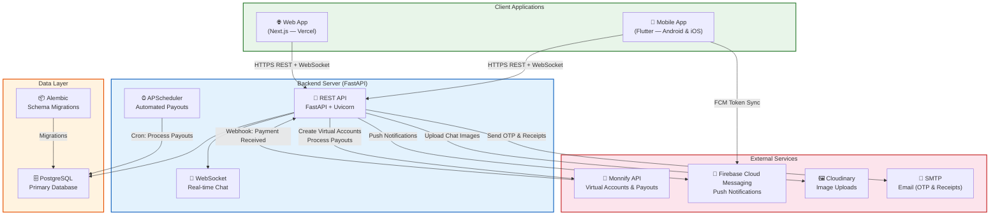
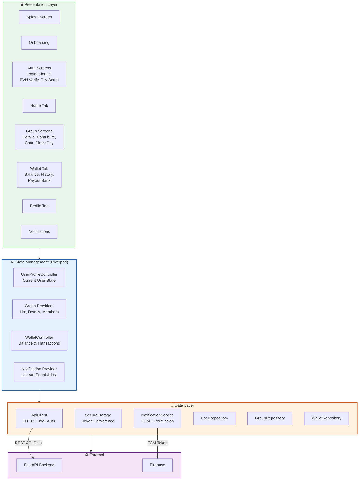
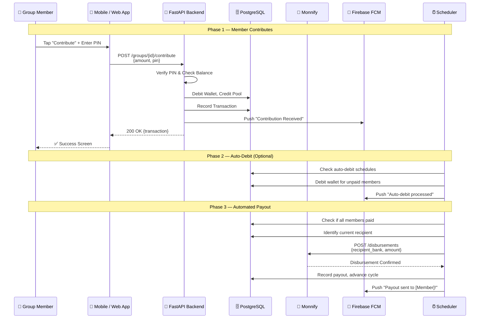
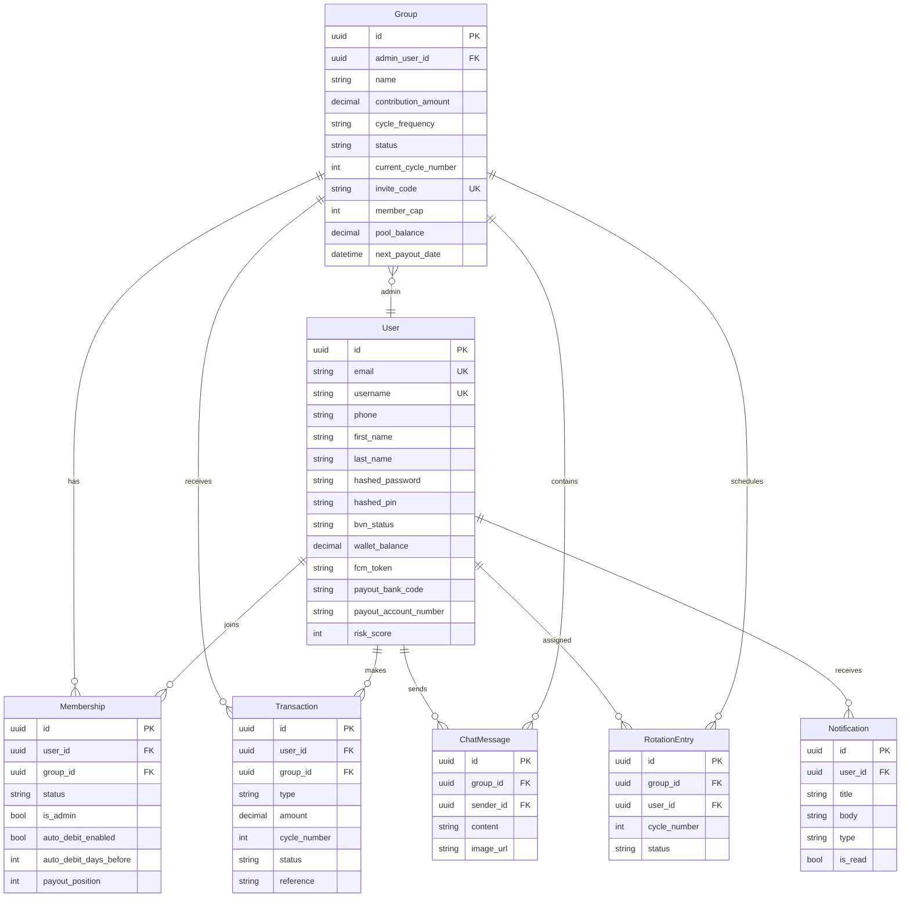
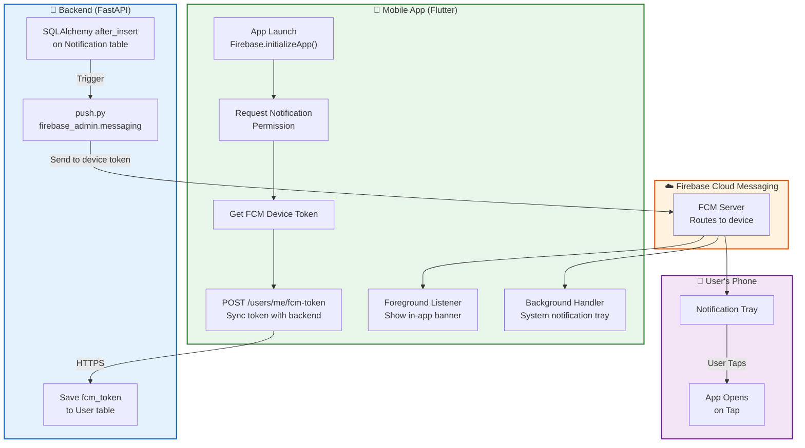
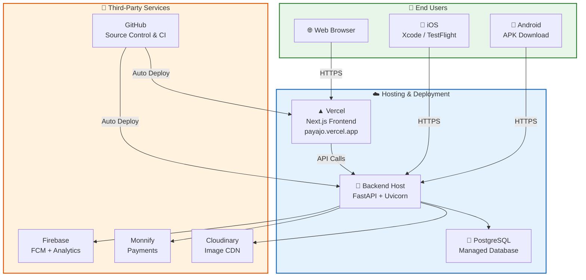

# PayAjo — Architecture Diagrams

---

## 1. System Architecture Overview

High-level view of the entire PayAjo platform showing how the Mobile App, Web App, Backend API, Database, and External Services interconnect.

---

## 2. Backend Modular Architecture

The backend follows a modular domain-driven design. Each domain module contains its own `models.py`, `schemas.py`, `service.py`, and `router.py`.

```mermaid
graph LR
    subgraph Core["⚙️ Core Layer"]
        Config["config.py<br/>Environment & Settings"]
        DB["database.py<br/>SQLAlchemy Engine"]
        Security["security.py<br/>JWT & Password Hashing"]
        PinLimiter["pin_limiter.py<br/>Brute-force Protection"]
        SchedulerCore["scheduler.py<br/>APScheduler Setup"]
        WSManager["websocket.py<br/>Connection Manager"]
    end

    subgraph Modules["📦 Domain Modules"]
        Auth["🔐 Auth<br/>Login, Register, OTP,<br/>Password Reset"]
        User["👤 User<br/>Profile, KYC, BVN,<br/>PIN, FCM Token"]
        Group["👥 Group<br/>Create, Join, Invite,<br/>Start, Edit"]
        Membership["🤝 Membership<br/>Approve, Remove,<br/>Pending Members"]
        Cycle["🔄 Cycle<br/>Rotations, Swaps,<br/>Delegations"]
        Transaction["💰 Transaction<br/>Contributions, Payouts,<br/>Wallet History"]
        Chat["💬 Chat<br/>WebSocket Messages,<br/>Image Uploads"]
        Notification["🔔 Notification<br/>In-app Alerts,<br/>FCM Push Triggers"]
        Webhook["🪝 Webhook<br/>Monnify Payment<br/>Confirmations"]
    end

    subgraph Services["🔧 External Service Layer"]
        MonnifyService["monnify.py<br/>Virtual Accounts & Disbursement"]
        PushService["push.py<br/>Firebase Admin SDK"]
        EmailService["email.py<br/>SMTP + HTML Templates"]
        CloudinaryService["cloudinary.py<br/>Image CDN"]
        RiskService["risk.py<br/>Risk Scoring"]
        AIService["ai.py<br/>AI-Powered Features"]
    end

    Core --> Modules
    Modules --> Services

    style Core fill:#e8eaf6,stroke:#283593,stroke-width:2px
    style Modules fill:#e8f5e9,stroke:#2e7d32,stroke-width:2px
    style Services fill:#fff3e0,stroke:#e65100,stroke-width:2px
```

---

## 3. Mobile App Architecture (Flutter)

The Flutter mobile app follows a feature-first architecture with Riverpod for state management.

---

## 4. Contribution & Payout Data Flow

Shows the complete lifecycle of a savings group contribution round — from payment to automated payout.

---

## 5. Database Schema (Key Entities)

---

## 6. Push Notification Flow

---

## 7. Deployment Architecture

---

## Tech Stack Summary

| Layer | Technology | Purpose |
|-------|-----------|---------|
| **Mobile** | Flutter (Dart) | Cross-platform Android & iOS app |
| **Web Frontend** | Next.js 16 + TailwindCSS | Landing page + Web dashboard |
| **Backend API** | FastAPI (Python) | REST API + WebSocket |
| **Database** | PostgreSQL + SQLAlchemy | Relational data storage |
| **Migrations** | Alembic | Database schema versioning |
| **State Mgmt** | Riverpod | Flutter state management |
| **Auth** | JWT (access + refresh tokens) | Stateless authentication |
| **Payments** | Monnify | Virtual accounts & disbursement |
| **Push Notifications** | Firebase Cloud Messaging | Real-time device notifications |
| **Image Storage** | Cloudinary | Chat image uploads & CDN |
| **Email** | SMTP + HTML Templates | OTP verification & receipts |
| **Scheduling** | APScheduler | Automated payouts & auto-debit |
| **Deployment** | Vercel + Render | Frontend & Backend hosting |
| **Source Control** | GitHub | Version control & CI/CD |
